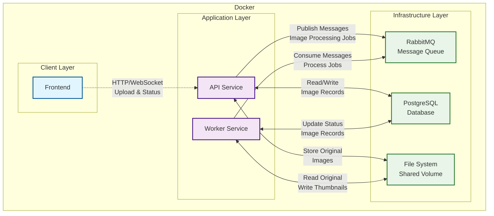

# RabbitMQ Image Processing System

A decoupled image upload and processing system built to learn message queue concepts with RabbitMQ. The system handles image uploads asynchronously, with background processing for resizing and compression.

## 🏗️ Architecture Overview



## 🚀 Features

- **Asynchronous Image Processing**: Upload images instantly while processing happens in background
- **Message Queue Integration**: Learn RabbitMQ concepts with real-world implementation
- **Image Optimization**: Automatic resizing and compression of uploaded images
- **Status Tracking**: Monitor processing status through database records
- **Shared Storage**: Single machine deployment with shared file system
- **Optional Frontend**: View upload status and thumbnails (via polling or WebSocket)

## 🛠️ Tech Stack

- **API Service**: Node.js/Express
- **Worker Service**: Python
- **Message Queue**: RabbitMQ
- **Database**: PostgreSQL
- **Frontend**: React
- **Containerization**: Docker & Docker Compose
- **File Storage**: Shared volume mount

## 📋 Prerequisites

- Docker and Docker Compose installed
- Basic understanding of message queues
- Familiarity with your chosen programming language (Node.js)

## 🔄 System Flow

### Image Upload Process

1. **Frontend/Client** uploads image to API service
2. **API Service**:
   - Validates and stores original image
   - Creates database record with `pending` status
   - Publishes message to RabbitMQ queue
   - Returns upload confirmation with tracking ID
3. **RabbitMQ** queues the processing job
4. **Worker Service**:
   - Consumes message from queue
   - Updates status to `processing`
   - Resizes and compresses image
   - Saves thumbnail to shared storage
   - Updates database record to `completed`
5. **Frontend** polls API or receives WebSocket update for status

### Database Schema

```sql
CREATE TABLE images (
    id SERIAL PRIMARY KEY,
    filename VARCHAR(255) NOT NULL,
    original_path VARCHAR(500) NOT NULL,
    thumbnail_path VARCHAR(500),
    file_size INTEGER,
    thumbnail_size INTEGER,
    status VARCHAR(20) DEFAULT 'pending',
    created_at TIMESTAMP DEFAULT CURRENT_TIMESTAMP,
    processed_at TIMESTAMP
);

-- Status values: 'pending', 'processing', 'completed', 'failed'
```

## 🔧 API Endpoints

### Upload Image

```http
POST /api/upload
Content-Type: multipart/form-data

{
  "image": <file>
}
```

**Response:**

```json
{
  "id": 123,
  "filename": "image.jpg",
  "status": "pending",
  "message": "Image uploaded successfully"
}
```

### Check Status

```http
GET /api/images/:id
```

**Response:**

```json
{
  "id": 123,
  "filename": "image.jpg",
  "status": "completed",
  "original_path": "/uploads/image.jpg",
  "thumbnail_path": "/thumbnails/image_thumb.jpg",
  "created_at": "2024-01-01T10:00:00Z",
  "processed_at": "2024-01-01T10:00:05Z"
}
```

### Get Thumbnail

```http
GET /api/thumbnails/:id
```

Returns the processed thumbnail image.

## 🔌 RabbitMQ Integration

### Queue Configuration

```javascript
// Publisher (API Service)
const message = {
  imageId: 123,
  originalPath: '/uploads/image.jpg',
  thumbnailPath: '/thumbnails/image_thumb.jpg'
};

channel.sendToQueue('image_processing', Buffer.from(JSON.stringify(message)), {
  persistent: true
});
```

### Consumer (Worker Service)

```javascript
channel.consume('image_processing', async (msg) => {
  const { imageId, originalPath, thumbnailPath } = JSON.parse(msg.content.toString());
  
  try {
    await processImage(imageId, originalPath, thumbnailPath);
    channel.ack(msg);
  } catch (error) {
    console.error('Processing failed:', error);
    channel.nack(msg, false, true); // Requeue on failure
  }
});
```

## 🎯 Learning Objectives

This project helps you understand:

- **Message Queue Patterns**: Producer-Consumer pattern with RabbitMQ
- **Asynchronous Processing**: Decoupling API responses from heavy processing
- **Queue Durability**: Handling message persistence and acknowledgments
- **Error Handling**: Dead letter queues and retry mechanisms
- **Microservices Communication**: Service-to-service messaging
- **Docker Orchestration**: Multi-container applications with shared resources

## 🔍 Monitoring and Debugging

### RabbitMQ Management UI

- Access: <http://localhost:15672>
- Monitor queues, exchanges, and message rates
- View message details and consumer activity

### Database Monitoring

```sql
-- Check processing status distribution
SELECT status, COUNT(*) FROM images GROUP BY status;

-- View recent uploads
SELECT * FROM images ORDER BY created_at DESC LIMIT 10;

-- Check processing times
SELECT 
  filename, 
  status,
  EXTRACT(EPOCH FROM (processed_at - created_at)) as processing_seconds
FROM images 
WHERE processed_at IS NOT NULL;
```

## 🚀 Scaling Considerations

### Horizontal Scaling

- Run multiple worker instances: `docker-compose up --scale worker-service=3`
- Each worker competes for messages in the queue
- RabbitMQ automatically load balances

### Performance Optimization

- Adjust worker concurrency based on CPU/memory
- Implement message prefetch limits
- Use appropriate image processing libraries (Sharp for Node.js, Pillow for Python)

## 🐛 Troubleshooting

### Common Issues

**Images stuck in 'processing' status:**

- Check worker service logs: `docker-compose logs worker-service`
- Verify RabbitMQ connectivity
- Ensure shared volume permissions

**High memory usage:**

- Reduce worker concurrency
- Implement image size limits
- Add memory limits to Docker containers

**Queue buildup:**

- Scale worker services
- Check for processing errors
- Monitor disk space for image storage

## 🔮 Future Enhancements

- [ ] Add image format conversion (JPEG, PNG, WebP)
- [ ] Implement different thumbnail sizes
- [ ] Add image metadata extraction
- [ ] Implement dead letter queue for failed jobs
- [ ] Add WebSocket real-time status updates
- [ ] Create admin dashboard for queue monitoring
- [ ] Add image optimization based on device type
- [ ] Implement batch processing capabilities

## 📚 Additional Resources

- [RabbitMQ Tutorial](https://www.rabbitmq.com/tutorials/tutorial-one-javascript.html)
- [Docker Compose Documentation](https://docs.docker.com/compose/)
- [PostgreSQL Docker Guide](https://hub.docker.com/_/postgres)
- [Image Processing Best Practices](https://web.dev/fast/#optimize-your-images)
