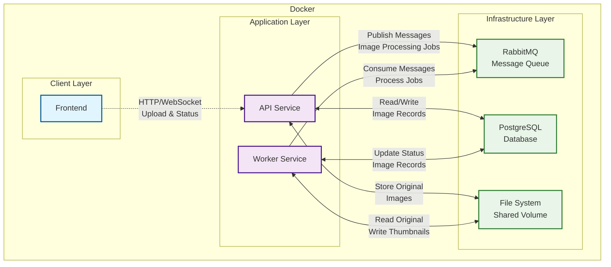

# RabbitMQ Image Processing System

A decoupled image upload and processing system built to learn message queue concepts with RabbitMQ. The system handles image uploads asynchronously, with background processing for resizing and compression.

## 🏗️ Architecture Overview



## 🚀 Features

- **Asynchronous Image Processing**: Upload images instantly while processing happens in background
- **Message Queue Integration**: Learn RabbitMQ concepts with real-world implementation
- **Image Optimization**: Automatic resizing and compression of uploaded images
- **Status Tracking**: Monitor processing status through database records
- **Shared Storage**: Single machine deployment with shared file system
- **Optional Frontend**: View upload status and thumbnails (via polling or WebSocket)

## 🛠️ Tech Stack

- **API Service**: Node.js/Express
- **Worker Service**: Python
- **Message Queue**: RabbitMQ
- **Database**: PostgreSQL
- **Frontend**: React
- **Containerization**: Docker & Docker Compose
- **File Storage**: Shared volume mount

## 📋 Prerequisites

- Docker and Docker Compose installed is enough to spin up application

### Local development

- OS: Ubuntu 24.04
- Python: 3.9.23
- Nodejs: 22.14.0

## 🔄 System Flow

### Image Upload Process

1. **Frontend/Client** uploads image to API service
2. **API Service**:
   - Validates and stores original image
   - Creates database record with `pending` status
   - Publishes message to RabbitMQ queue
   - Returns upload confirmation with tracking ID
3. **RabbitMQ** queues the processing job
4. **Worker Service**:
   - Consumes message from queue
   - Updates status to `processing`
   - Resizes and compresses image
   - Saves thumbnail to shared storage
   - Updates database record to `completed`
5. **Frontend** polls API or receives WebSocket update for status

### Database Schema

```sql
CREATE TABLE IF NOT EXISTS images (
    id SERIAL PRIMARY KEY,
    
    -- File information
    original_filename VARCHAR(255) NOT NULL,
    stored_filename VARCHAR(255) NOT NULL UNIQUE,  
    file_size INTEGER NOT NULL,      
    mime_type VARCHAR(50) NOT NULL, 
    -- Processing status
    status VARCHAR(20) NOT NULL DEFAULT 'pending',
    error_message TEXT, 
    
    thumbnail_filename VARCHAR(255),            
    thumbnail_size INTEGER,    
    
    -- Timestamps
    uploaded_at TIMESTAMP DEFAULT CURRENT_TIMESTAMP,
    processing_started_at TIMESTAMP,
    completed_at TIMESTAMP,
    
    -- Constraints
    CONSTRAINT valid_status CHECK (status IN ('pending', 'processing', 'completed', 'failed'))
);
```

## 🔧 API Endpoints

### Image

#### Upload

```http
POST /api/upload
Content-Type: multipart/form-data

{
  "image": <file>
}
```

**Response:**

```json
{
    "id": 1,
    "uploadedFilename": "example.jpg",
    "storedFilename": "example0.jpg",
    "message": "Image uploaded successfully. Waiting for further proccessing..."
}
```

#### Get

```http
GET /api/images/:filename
```

### Thumbnail

#### Get

```http
GET /api/thumbnails/:filename
```

### Other

#### Health check

```http
GET /health
```

**Response:**

```json
{
    "backend": "ok",
    "database": "ok",
    "messageQueue": "ok"
}
```

#### Clear images and queue

```http
DELETE /reset
```

## 🔌 RabbitMQ Integration

### Queue Configuration

```javascript
// Publisher (API Service)
const message = {
  imageId,
  originalPath,
  originalFilename
  thumbnailPath,
  thumbnailFilename,
}

channel.sendToQueue('thumbnail_processing', Buffer.from(JSON.stringify(message)), {
  persistent: true
});
```

## 🎯 Learning Objectives

This project helps you understand:

- **Message Queue Patterns**: Producer-Consumer pattern with RabbitMQ
- **Asynchronous Processing**: Decoupling API responses from heavy processing
- **Queue Durability**: Handling message persistence and acknowledgments
- **Error Handling**: Dead letter queues and retry mechanisms
- **Microservices Communication**: Service-to-service messaging
- **Docker Orchestration**: Multi-container applications with shared resources

## 🔍 Monitoring and Debugging

### RabbitMQ Management UI

- Access: <http://localhost:15672>
- Monitor queues, exchanges, and message rates
- View message details and consumer activity

## 🔮 Future Enhancements

- [ ] A web front-end client, with real-time status updates

## 📚 Additional Resources